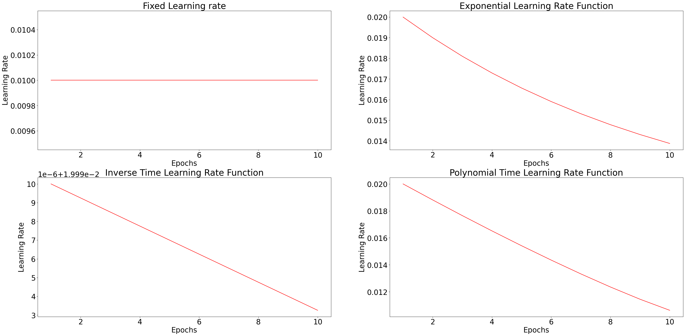
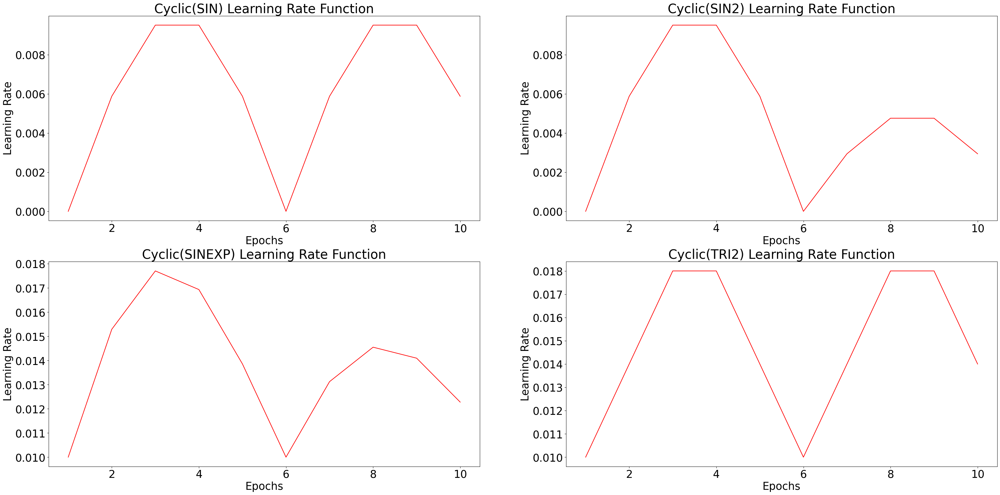
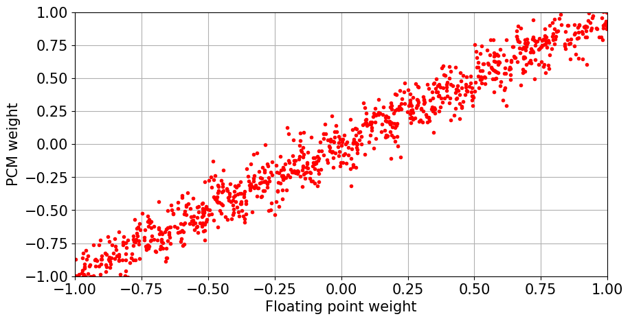
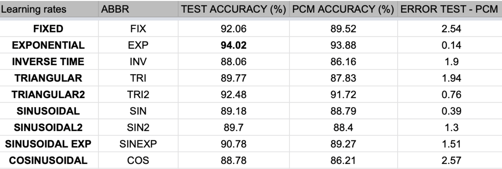

# Neuromorphic-Probabalistic-Learning

Probabalistic Learning Framework implementing surpervised learning to solve the MNIST hand-written digit recognition problem using Neuromorphic Spiking Neural Networks. Performance of the models were also evaluated when transferring weights from floating point to low precision weights/using Phase Change Memory such as that would be in the case of transferring the model to a Neuromorphic based chip.

##  Learning Rates

Several learning rate functions were experimented with:

 

## Synaptic Weight - Phase Change Memory Conversion

4 bit precision with a standard deviation of 0.1

## Evaluation

